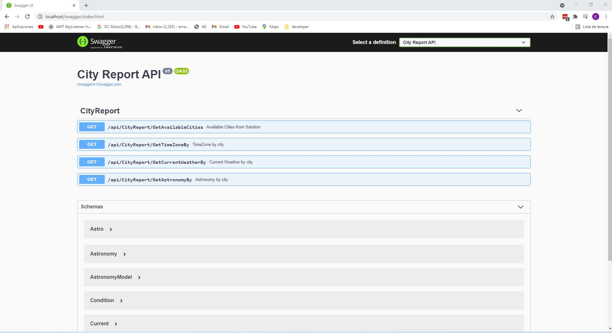
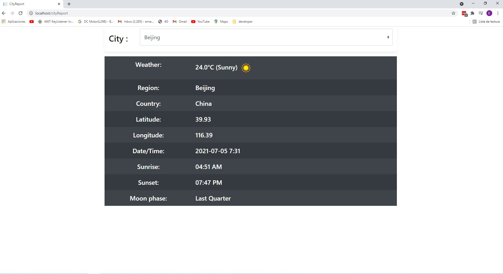

# CityReport

CityReport is a small web app that delivers some information like timezone, currentWeather, and astronomy associated with a city 

## Backend (REST API)
This API is using the latest version of  asp.net core (version 5)  
and consists in 4 endpoints:
1. /api/CityReport/GetAvailableCities
    - the default list of cities working on solution are "Beijing","Nairobi","New York","Mumbai","Paris","Sydney", they can be modified any time by changing appsettings.json file on cityReport project
    where "Available_Cities" : is shown. 
2. /api/CityReport/GetTimeZoneBy
    - Gets region,country,latitude,longitude,localtime values
3. /api/CityReport/GetCurrentWeatherBy
    - Gets temperature and weather condition
4. /api/CityReport/GetAstronomyBy
    - Gets moon phase,sunrise and sunset time

you can find as well the documentation from every endpoint fully described on Swagger UI 

* Swagger UI on `http://localhost/swagger/index.html`


Unit tests from backend are located on CityReport.Tests project on solution 


## Frontend 

The folder ClientApp from solution houses the frontend part of cityReport app and the technologie being used is React
Unit tests from frontend are located on ClientAPP/src/components/__tests__ folder on cityReport solution 

* The CityReport UI is working with the backend on `http://localhost/cityReport`


These are the only Authorized URLs on cityReport app
* `http://localhost/swagger/index.html`
* `http://localhost/cityReport`


## Docker

This solution contains a docker-compose.yaml file that define the configuration of the container 
the user should be able to fetch/clone this repository from github and able to execute the following command

`````````````````
docker compose up
`````````````````

**the port configuration is 80** , but user can feel  free to change it on  **docker-compose.yaml** file 


